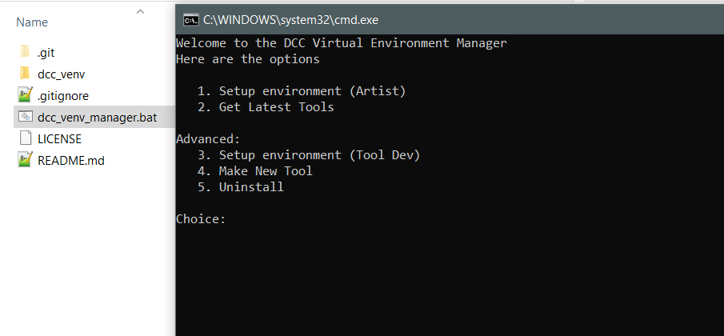

# dcc-venv
Python virtual environment manager for Digital Content Creation software

This is a collection of .bat scripts that will setup a virtual environment for all the DCC configs that can be found in the [dcc_venv](https://github.com/rBrenick/dcc-venv/tree/master/dcc_venv) folder.



## Currently supported DCCs:
```
Maya
Motionbuilder
```

On DCC startup it will add the venv site-packages folder to the DCC's sys.path


## Requires:
```
Python 3.3 or later
pip
```


## How the configs work

Each folder in dcc_venv contains
```
requirements.txt
venv_install.bat
venv_uninstall.bat
```

On install the *requirements.txt* will be added to the virtual environment

The *venv_install.bat* will then run to figure out how to add the site-packages to the DCC on startup.


## What is "Setup Environment (Tool Dev)"

When running Setup Environment (Tool Dev), all the packages in requirements.txt below the **# DEV** comment will be pip installed -editable.

